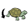
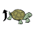

Logo Interpreter in JavaScript
==============================

My kids growing up fast. My older boy went to school this year, so I was thinking it's time to influence him with programming.
Therefore I quickly put together this visual Logo Interpreter for his birthday. It was 2 days project, only tested with Firefox. Icons from Google Images, I do not own them. It comes without any warranty in the hope that it will be useful for other kids too.

Enjoy!

File format
-----------

Loosely compatible with original logo. I've used "main(w,h)" as the main function, which receives screen dimensions. That function
cannot be called directly. Command arguments are separated by comma and variables are not prefixed by colon. It was easier to parse this way. Other keywords little bit modified, like "rand variable, min, max" which will generate a random number between [min, max) and will store it in the given variable.

Don't expect failsafes in code loading, I've just provided a way to load ".lgo" files as they were saved. It is definitely not for importing hand written source code. Executing the code on the other hand does syntactically check commands, and provides visual feedback along with error messages on JavaScript console.

Interface
---------

Very intuitive. Just drag'n'drop the command icons from the toolbar to one of the function panels. It will ask for the command's 
arguments in a guided manner. You can move and re-arrange the commands on the panel by drag'n'dropping their icons. By pressing
<kbd>Shift</kbd> during drag'n'drop, you can copy commands and entire 'if' or 'repeat' blocks. To delete commands from a function, simply drag'n'drop outside of the function panel. Clicking on a command's icon will allow you to modify it's arguments.

 adds a new function. You have to specify it's name and parameters in parenthesis.
For parameter names, just like with variable names, only latin letters allowed (no numbers or special characters for box labels). Function names must be unique, you cannot overload them with different parameters. Functions are like to do lists. Each list has a name, some box labels and commands to do. The commands in the list are referencing to box labels (arguments), and you put something (a value) in each box before you tell the turtle to follow the to do list.

 removes a function. If you forgot to remove it's references, those calls will be visually marked. The turtle does not know how to follow a to do list if that list does not exists any more.

 setup. You can specify the file name (used with Save) and some execution properties. You can turn off displaying the turtle here, and you can also enable command trace (displayed on JavaScript console).

 starts execution by invoking 'main(w,h)' function. In case of run-time error, the appropriate command will be visually marked. Tell the turtle, 'do the thing'! :-)

 load a previously saved ".lgo" file from the file system.

 convert function panel into a plain text logo source and save it on the file system. You can specify the file name to use in Setup. Once saved, you can open it a text editor to see the source code that corresponds to the visual interface.

 reset function panel, drop everything. Lobotomy for the turtle.

 tutorials. You can load one of the built-in examples by clicking on this icon. Once a tutorial is loaded, you can save it on your machine.

 `forward x`. Moves the turtle forward.

 `backward x`. Makes the turtle to move backward.

 `left x`. Turns the turtle anti-clockwise. The unit is degree (0-360).

 `right x`. Turns the turtle clock-wise.

 `pendown`. Tell the turtle to put down its tail, so that any movements (forward or backward) will leave mark in the sand.

 `penup`. tell the turtle to lift up its tail. With tail lifted up, you can freely move the turtle without drawing anything.

 `color c`. Put some color paint on the turtle's tail so that it will leave marks with a specific color.

 `text size,string`. Because our turtle is very smart, you can tell it to write letters in the sand without specifying where to go and when to turn to get for example a letter 'A'. When the job is done, the turtle will return to it's original position (in other words writing letters does not move the turtle).

 `variable=expression`. The turtle has many boxes (variables), each with a label on it. You can tell the turtle to put something in one of the boxes with this. Later you can reference what's inside (value) by the box label (variable name). Some box labels are defined as function parameters. Using a previously non-existed variable will make the turtle to get a new box and label it.

 `func(a,b,É)`. Call a function. Put values in some boxes (specified by function parameters), and start executing the to do list.

 `if expression [ É ] else [ É ]`. Conditional blocks. Tells the turtle to check some box, and if they contain what specified, follow the commands on the left; if they differ, follow the commands on the right.

 `repeat expression [ É ]`. Tells the turtle to repeat commands for specified times. Inside a repeat block, the special 'repcount' box holds the current iteration counter.

 `question variable,default,string`. Tells the turtle to ask something, and put the answer in a box (variable).

 `rand variable,min,max`. Make the turtle gambling. It will throw several dices, and put the result in the specified box.

 `alert string`. If something is wrong, makes the turtle cry out loud.

 `debug expression`. Will report messages in JavaScript console. It's useful to see what's inside a box.

Known bugs
----------

Unfortunately using degree has it's drawback. There could be rounding-error "glitches" when using smaller angles for rotation, as Firefox can't rotate 2d canvas by unlimited precision. For example see the 'curly' tutorial.

Authors
-------

bzt
